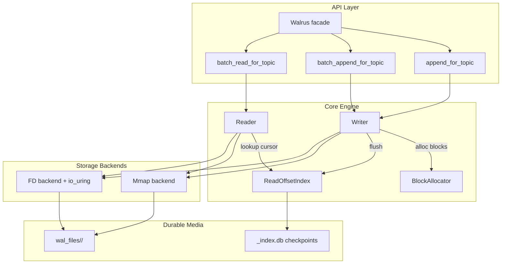
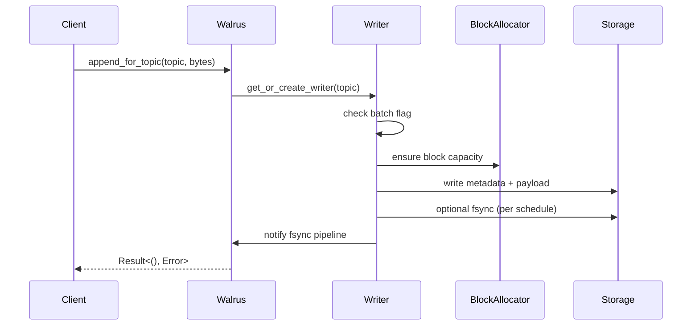
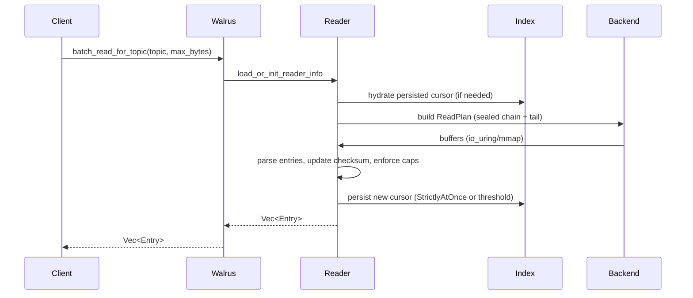

# Walrus Architecture

Walrus is a write-ahead log (WAL) engine tuned for high-throughput streaming
workloads. It exposes simple append/read APIs while hiding the complexity of
block management, persistence, and batching underneath. This document walks
through the major components and the way data flows between them.

## Layered View

## Storage Layout

- **Files**: Each log file is pre-allocated to `MAX_FILE_SIZE` (100 × 10 MB
  blocks) and named with a millisecond timestamp. Files live under
  `wal_files/<namespace>/`.
- **Blocks**: Fixed 10 MB logical segments tracked by `BlockAllocator`. A block
  becomes *sealed* when the writer advances to the next block; sealed blocks are
  appended to the reader chain.
- **Metadata prefix**: Every entry stores a 64-byte metadata prefix containing
  the owning topic, payload size, and checksum (FNV-1a).
- **Index files**: `<topic>_index.db` stores the reader cursor so AtLeastOnce
  consumers can resume after restart.

### Namespacing & Locations

- Set `WALRUS_DATA_DIR` to relocate the entire tree from `wal_files/` to an
  alternate base directory (useful for containerized deployments).
- Pass an instance key (`Walrus::new_for_key`, or `WALRUS_INSTANCE_KEY`) to
  scope files into `wal_files/<sanitized-key>/` (or the equivalent under the
  custom data dir). Non-alphanumeric characters are replaced with `_`; empty
  keys fall back to `ns_<checksum>`.

## Write Path

### Batch Writes

- `MAX_BATCH_ENTRIES` (2,000) bounds both regular and batch operations to stay
  under the `io_uring` submission queue limit (2,047).
- `batch_append_for_topic` acquires an atomic flag, pre-plans all block writes,
  and submits them through `io_uring` when the FD backend is active.
- fsync requests are buffered and optionally grouped so multiple file handles
  can share a single submission queue.
- On any failure we roll back the writer offset and hand unused blocks back to
  the allocator.

## Read Path

### Highlights

- The read plan walks sealed blocks first and then the active writer tail.
- On Linux with the FD backend enabled, we submit one read per range through
  `io_uring`. On other platforms we fall back to direct mmap reads.
- Parsing enforces both the caller-specified `max_bytes` budget and the global
  `MAX_BATCH_ENTRIES` cap to keep the submission queue safe.
- StrictlyAtOnce mode holds the reader lock through IO to guarantee
  single-consumption semantics; AtLeastOnce releases it before issuing reads.
- Checkpointing progress is opt-in: both single and batch reads accept a boolean
  flag that leaves the cursor untouched when `false`, enabling non-destructive peeks.

## Backend Selection

- The FD backend uses fd-backed storage and enables `io_uring` batching on Linux.
- The mmap backend uses mmap-backed accesses; batch writes fall back to sequential writes and batch reads use direct mmap parsing.
- The default is FD+`io_uring` when supported; non-Linux builds automatically live on the mmap backend.

## Concurrency & Synchronization

- **Writers**: Guarded by mutexes for `current_block` and `current_offset` plus
  an `is_batch_writing` atomic flag that prevents concurrent batches.
- **Readers**: Each topic keeps a `ColReaderInfo` structure behind an `RwLock`.
  StrictlyAtOnce leverages write locks to serialize batched reads; AtLeastOnce
  relaxes that to allow concurrent readers with periodic checkpoints.
- **Allocator**: Uses internal synchronization to distribute blocks and track
  file usage. Newly allocated blocks are marked *locked* until a batch succeeds.
- **Fsync pipeline**: A background thread drains a channel of fsync requests and
  optionally consolidates them into `io_uring` batches.

## Recovery

1. On startup we scan `wal_files/<namespace>/` and mmap every file.
2. Each block is replayed to rebuild the reader chain and block registry.
3. The read offset index is consulted for persisted cursors; any tail offsets
   are folded back into the active chain to ensure readers resume exactly where
   they left off.
4. Stale mmap references and file descriptors are tracked by `SharedMmapKeeper`,
   `BlockStateTracker`, and `FileStateTracker`.

## Testing & CI

- The test matrix under `tests/` covers batch reads, writes, integration, and
  long-running scenarios. Each binary is exercised on self-hosted runners via
  `.github/workflows/tests.yml`.
- Additional CI coverage in `.github/workflows/ci.yml` runs targeted
  e2e scenarios (sustained workloads, recovery, stress) alongside unit and
  integration suites.

## Key Constants

| Constant | Value | Purpose |
|----------|-------|---------|
| `DEFAULT_BLOCK_SIZE` | 10 MB | Logical block size in each WAL file |
| `BLOCKS_PER_FILE` | 100 | Number of blocks per pre-allocated file |
| `MAX_FILE_SIZE` | 1 GB | Derived from block size × blocks per file |
| `MAX_ALLOC` | 1 GB | Allocation guard for block planning |
| `MAX_BATCH_ENTRIES` | 2,000 | Entry cap shared by batch writes and reads |
| `PREFIX_META_SIZE` | 64 bytes | Metadata prefix length per entry |

## Component Cheat Sheet

- `Walrus`: Public facade, handles instance configuration, fsync scheduling,
  and namespace management.
- `BlockAllocator`: Owns file creation, block leasing, and reclamation.
- `Writer`: Manages per-topic append state, allocating blocks and coordinating
  normal and batched writes.
- `Reader`: Tracks per-topic read cursors, builds read plans, and orchestrates
  buffered IO.
- `ReadOffsetIndex`: Persists read cursors to `<topic>_index.db`.
- `SharedMmapKeeper`: Caches mmaps / file descriptors and coordinates the FD and
  mmap backends.

This architecture is designed around predictable IO patterns, compatibility
with `io_uring`, and clear separation between the API surface and the
performance-critical internals. The shared `MAX_BATCH_ENTRIES` cap for both
readers and writers ensures that even under heavy batching the submission queue
stays within the kernel’s limits, preserving throughput and stability.
